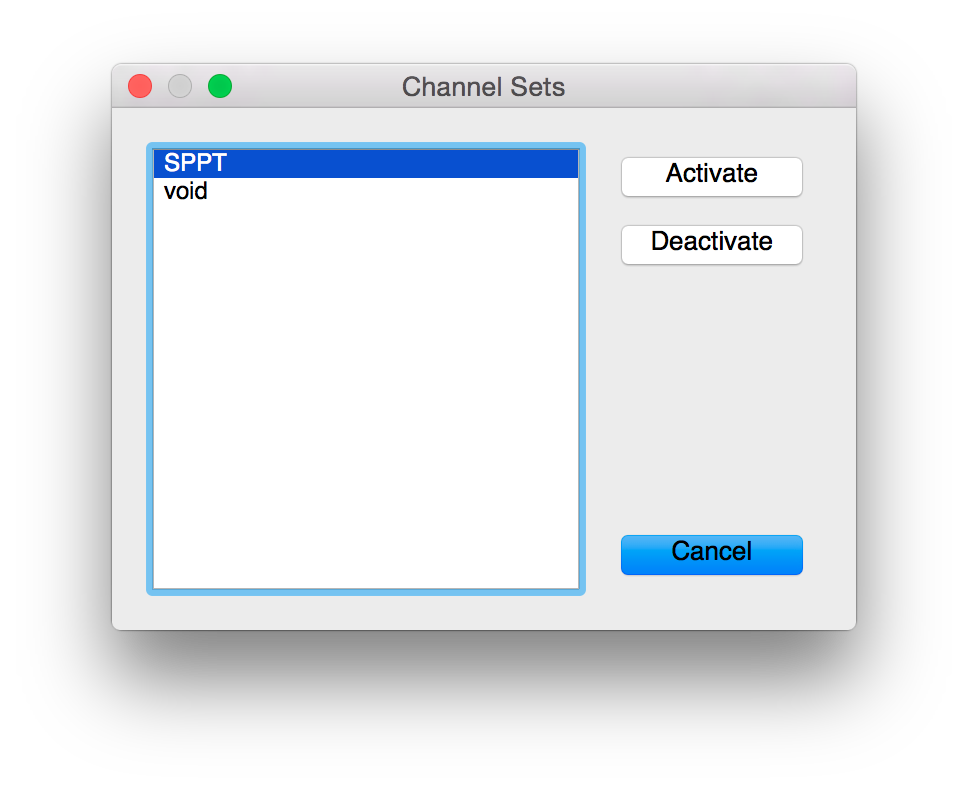

pyDAQConfig
===========

A Python package and GUI for activating DAQ channels in the Glasgow CDS system.

### Objectives

- replacement for `daqconfig`
- always keep a backup file 
- allow a post-save command, which e.g. can commit the changed file to a repository
- quick acquisition of multiple channels via channel sets
- at some later point, allow browsing of old files/old versions in the repository, to re-enable those channels

Environment Variables
---------------------

The env variable `PYDAQCONFIG_CHAN_DIR` must be set to the directory which
stores the DAQ `.ini` files.

The env variable `PYDAQCONFIG_POST_SAVE_CMD` can specify a command which will be
run after saving the `.ini` files. The full path to the changed files will be
given as command line arguments.

Channel Sets
------------

To quickly acquire a larger number of channels, channel sets can be defined.
_pyDAQConfig_ looks in `PYDAQCONFIG_CHAN_DIR` for files with the ending `.set`.
These files should contain a list of channels (full channel name, i.e.
`X1:XYZ-SUBSYSTEM_CHANNEL_DQ`). Lines beginning with `#` will be ignored. The button
_Channel Sets..._ then calls up a dialog where all channel sets are listed.
Selecting a channel set and clicking _Activate_ enables all channels in that set
and sets them to acquire data. Clicking _Deactivate_ turns of data acquisition,
however it leaves the channel enabled so that data can be retrieved via e.g.
_ligoDV_.

Copyright
---------
This work is licensed under the Creative Commons Attribution-NonCommercial-
ShareAlike 4.0 International License. To view a copy of this license, visit
http://creativecommons.org/licenses/by-nc-sa/4.0/ or send a letter to Creative
Commons, PO Box 1866, Mountain View, CA 94042, USA.

---
-- Sebastian Steinlechner, Sean Leavey, 2015