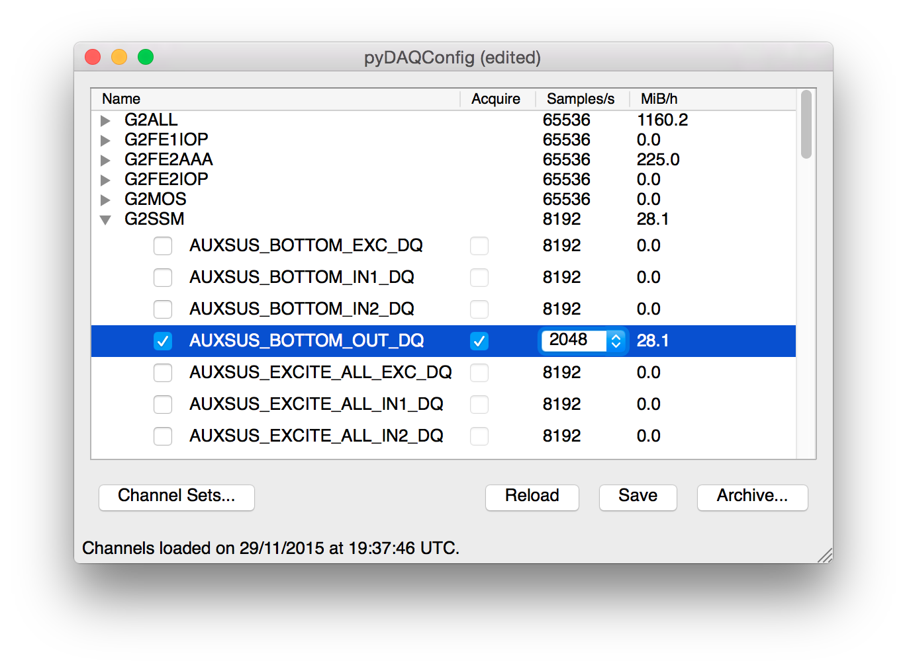

pyDAQConfig
===========

A Python package and GUI for activating DAQ channels in the Glasgow CDS system.

### Objectives

- replacement for `daqconfig`
- keep a backup file (no archive yet as with the old `daqconfig`)
- allow a post-save command, which e.g. can commit the changed file to a repository
- at some later point, allow browsing of old files/old versions in the repository, to re-enable those channels

Environment Variables
---------------------

The env variable `PYDAQCONFIG_CHAN_DIR` must be set to the directory which stores the DAQ `.ini` files.

The env variable `PYDAQCONFIG_POST_SAVE_CMD` can specify a command which will be run after saving the `.ini` files. The full path to the changed files will be given as command line arguments.

---
-- Sebastian Steinlechner, 2015